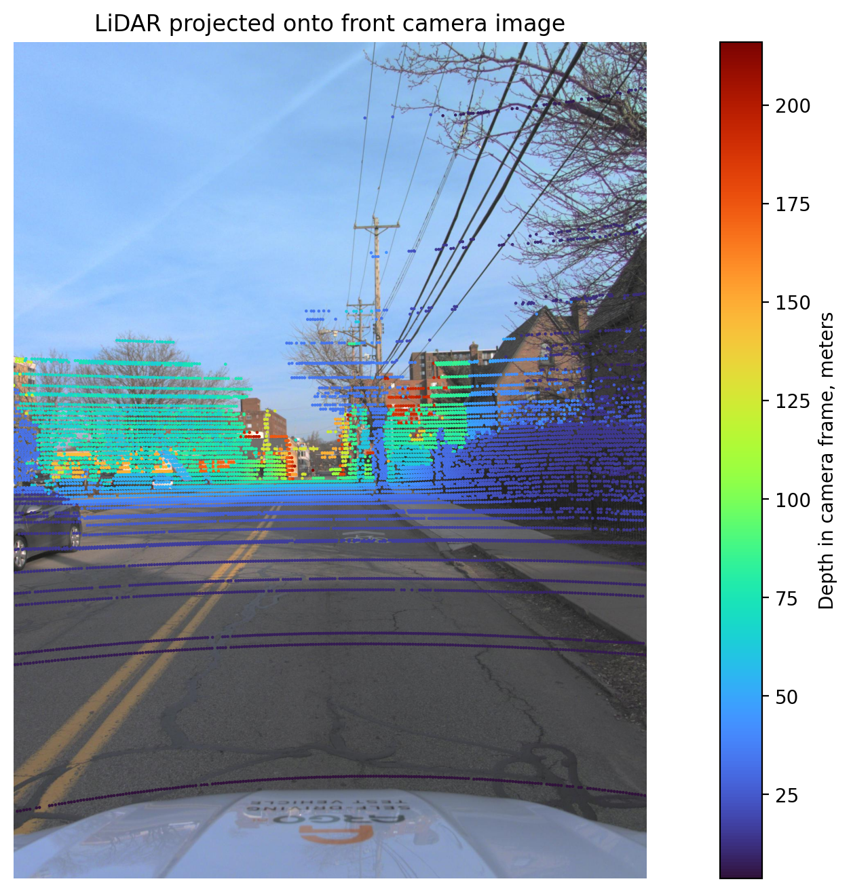
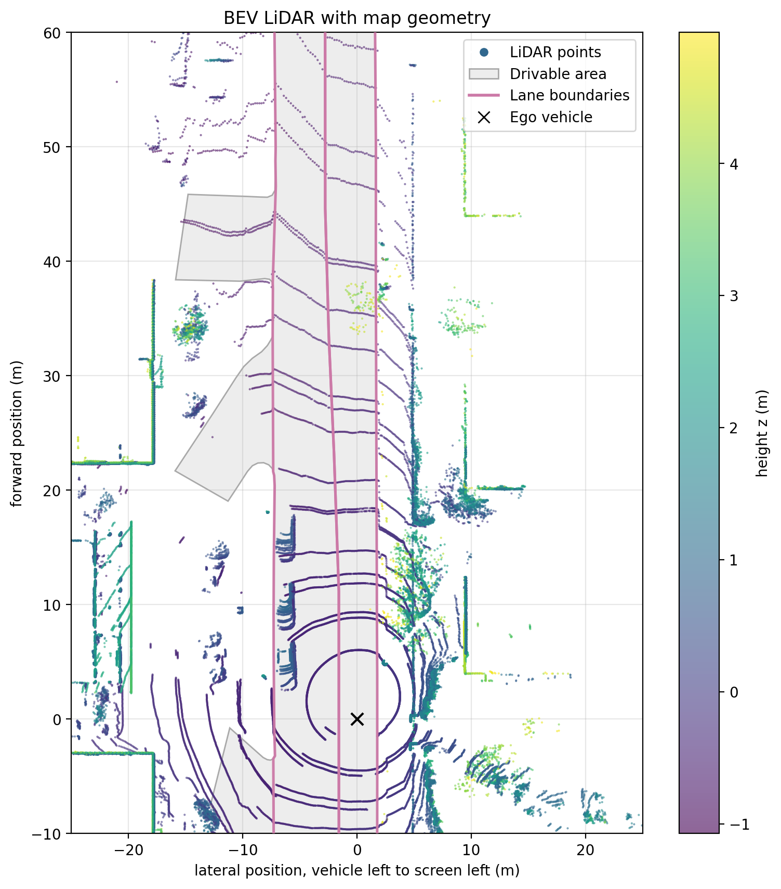
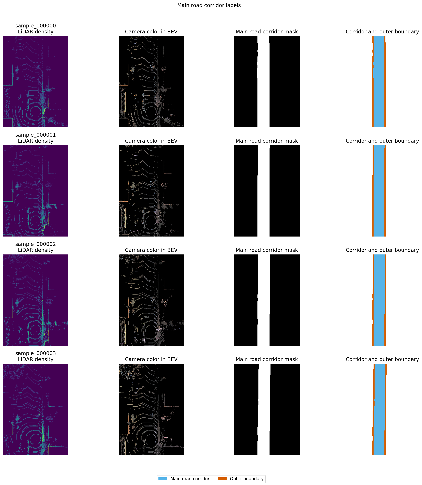
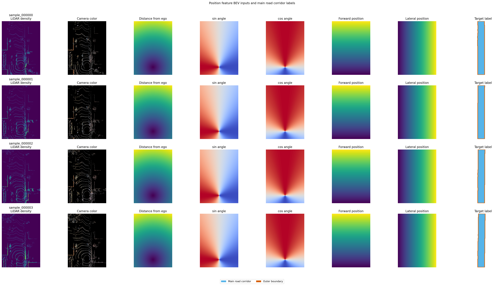
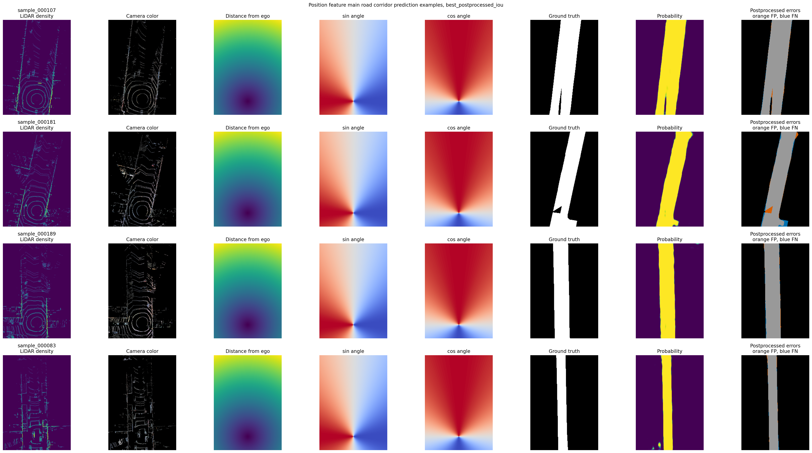
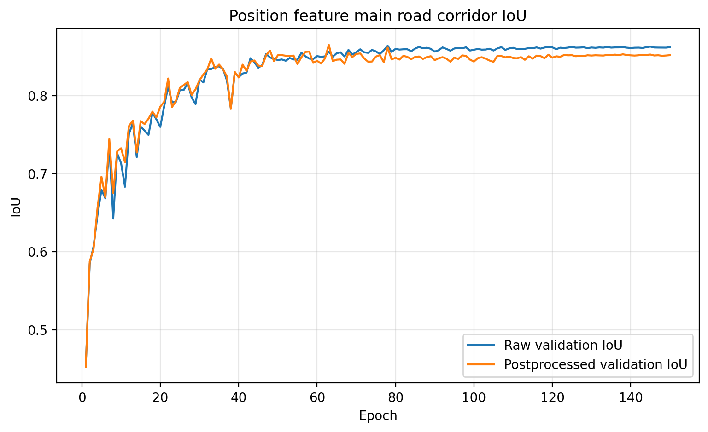
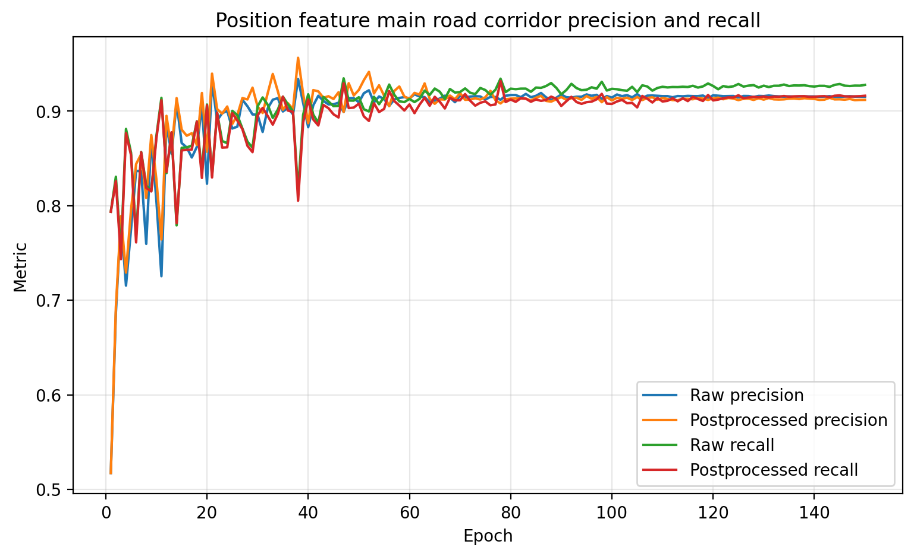

# BEV Road Corridor Segmentation from Camera and LiDAR

This project builds a compact BEV road corridor segmentation pipeline using Argoverse 2 camera, LiDAR, ego pose, and HD map data. It loads and aligns autonomous driving sensor data, creates BEV inputs, derives a main road corridor target from HD map lane geometry, trains segmentation baselines, and evaluates the final model with postprocessing.

The final result is a completed baseline study. The strongest model used LiDAR features, camera color sampled from seven ring cameras, and ego-position features to predict an ego-aligned main road corridor.

## Final result

The best model identified the main drivable corridor well in the validation examples, especially on straight road sections. Postprocessing improved the output by keeping the ego-connected component, filling holes, and removing disconnected prediction islands.

Remaining limitations were most visible on angled roads, farther forward regions, and samples where non-drivable regions existed inside the mapped road corridor. These limitations were acceptable for this baseline because the project goal was to build and analyze a focused road corridor segmentation workflow rather than a production road model.

## Dataset

This project uses the **Argoverse 2 Sensor Dataset**. Argoverse 2 data and derived figures are used under the Creative Commons Attribution-NonCommercial-ShareAlike 4.0 license. Argoverse 2 copyright notice: © 2021 Argo AI, LLC.

Only the validation split was used for these baseline experiments. The dataset is not included in this repository and should be downloaded separately.

Expected local structure:

```text
data/
└── av2/
    └── sensor/
        └── val/
```

The `data/av2/` folder is excluded from Git.

## Pipeline summary

```text
Argoverse 2 scene
        |
        v
Load camera images, LiDAR sweeps, calibration, ego pose, and HD map
        |
        v
Project LiDAR points into camera images
        |
        v
Create BEV LiDAR and HD map visualizations
        |
        v
Rasterize map-derived road labels
        |
        v
Create LiDAR, camera color, and ego-position BEV inputs
        |
        v
Train road corridor segmentation baselines
        |
        v
Postprocess predictions and evaluate failure modes
```

## Final model

The final model was trained on an eleven channel BEV input.

```text
input channels:
1. LiDAR point density
2. LiDAR maximum height
3. LiDAR mean height
4. Mean red value from projected camera pixels
5. Mean green value from projected camera pixels
6. Mean blue value from projected camera pixels
7. Normalized distance from ego
8. Sine of angle from ego
9. Cosine of angle from ego
10. Normalized forward position
11. Normalized lateral position

target:
main road corridor mask derived from ego-aligned lane boundary geometry
```

The target was created from lane boundary geometry rather than the full drivable area. Lane geometry was transformed into the ego frame, lane segments were filtered by heading alignment, and the resulting corridor was rasterized and cleaned into a continuous main road corridor mask.

## Key figures

### LiDAR projected onto front camera image



This figure shows LiDAR points projected into the front camera image using camera calibration, ego pose, and timestamp-matched LiDAR data.

### BEV LiDAR with map geometry



This figure shows the LiDAR sweep in BEV with HD map drivable area and lane boundaries overlaid.

### Main road corridor label



The main road corridor target was derived from ego-aligned lane geometry. This target removed much of the broad drivable area that caused side street overprediction in earlier experiments.

### Position feature dataset



The final dataset added ego-position channels to LiDAR and camera color inputs. These channels gave the model explicit information about distance from ego, angular position, forward position, and lateral position.

### Final model predictions



The final model identified the main drivable corridor well and postprocessing removed disconnected prediction islands.

### Final model metrics





The final model was evaluated using raw and postprocessed predictions. The postprocessed output was the most useful visual result because it removed isolated components that were not connected to the ego corridor.

## Main findings

- **Target definition mattered.** Full drivable area labels caused side street overprediction. A main road corridor target produced a cleaner learning problem.
- **Camera color improved the baseline.** RGB values sampled from projected LiDAR points gave the model useful visual context beyond LiDAR geometry alone.
- **Ego-position features produced the best result.** Distance, angle, forward position, and lateral position helped the model focus on the ego-aligned road corridor.
- **Postprocessing improved usability.** Keeping the ego-connected component and filling holes removed disconnected prediction islands.
- **Road geometry still affected performance.** Straight roads were strongest, angled roads were less accurate, and farther forward regions were less reliable.

## Detailed analysis

The detailed experiment history, failure analysis, and baseline comparison are documented here:

```text
report/bev_road_geometry_baseline_analysis.md
```

## Repository structure

```text
bev-road-corridor-segmentation/
├── data/
├── outputs/
├── report/
├── scripts/
├── README.md
├── requirements.txt
└── .gitignore
```

The `data/` folder stores the local Argoverse 2 dataset and is excluded from Git. The `outputs/` folder contains selected figures and training metrics used in the README and report. The `scripts/` folder contains visualization, data preparation, and training scripts. The `report/` folder contains the detailed technical analysis.

## Key scripts

```text
scripts/project_lidar_to_front_camera.py
```

Projects LiDAR points into the front camera image using calibration and ego pose.

```text
scripts/create_bev_lidar_map_visualization.py
```

Creates the BEV LiDAR and map geometry visualization.

```text
scripts/create_main_road_corridor_dataset_position_features.py
```

Creates the final eleven channel dataset with LiDAR, camera color, and ego-position features.

```text
scripts/train_main_road_corridor_position_model.py
```

Trains the final main road corridor segmentation model and saves training metrics and prediction figures.

Earlier baseline scripts are included in `scripts/` so the experiment progression can be reproduced.

## Environment

This project was developed on Windows using Python, PyTorch, and an NVIDIA RTX 3080 GPU.

Install dependencies with:

```powershell
python -m pip install -r requirements.txt
```

## License

The code in this repository is licensed under the MIT License.

This repository uses the Argoverse 2 Sensor Dataset. The Argoverse data, documentation, and any figures derived from Argoverse data are subject to the Argoverse license terms, including Creative Commons Attribution-NonCommercial-ShareAlike 4.0. The Argoverse dataset is not included in this repository.

Argoverse copyright notice: © 2018-2022 Argo AI, LLC.

## Tracked outputs

The repository keeps selected figures and training metrics needed to understand the project. Generated datasets, raw Argoverse data, and model checkpoint files are excluded from Git.

```text
outputs/figures/
outputs/model_drivable/training_history.csv
outputs/model_drivable/training_history.json
outputs/model_drivable_camera_color/training_history.csv
outputs/model_drivable_camera_color/training_history.json
outputs/model_main_road_corridor/training_history.csv
outputs/model_main_road_corridor/training_history.json
outputs/model_main_road_corridor_position_features/training_history.csv
outputs/model_main_road_corridor_position_features/training_history.json
```

## Conclusion

This project demonstrates a complete BEV road corridor segmentation workflow using camera, LiDAR, ego pose, and HD map geometry. The final position feature model was the strongest baseline. It identified the main road corridor well, especially on straight roads, and postprocessing produced a cleaner continuous output.

The project is complete as a baseline study. It shows how target design, camera context, BEV representation, spatial encoding, and postprocessing affect road corridor segmentation.
