# BEV Road Geometry Baseline Analysis

## Executive summary

This report documents a BEV road corridor segmentation baseline study using Argoverse 2 camera, LiDAR, ego pose, and HD map data. The work progressed from broad drivable area prediction to a more focused ego-aligned road corridor target.

The strongest result came from the final position feature model. It used LiDAR features, camera color sampled from seven ring cameras, and ego-position channels to predict a main road corridor derived from lane boundary geometry. Postprocessing removed disconnected prediction islands and produced the cleanest final output.

The final model was strongest on straight road segments. Angled roads, farther forward regions, and non-drivable regions inside the mapped corridor remained more difficult.

## Dataset and BEV setup

The dataset was created from Argoverse 2 validation scenes. For each sample, a BEV grid was created around the ego vehicle and paired with a map-derived target label.

The BEV region was:

```text
forward range: -10 m to 60 m
lateral range: -25 m to 25 m
resolution: 0.25 m per pixel
```

The labels were generated from HD map geometry. Two target types were created during the project:

1. Full drivable area masks from HD map drivable area polygons
2. Main road corridor masks derived from ego-aligned lane boundary geometry

## Sensor alignment and map visualization

The first part of the project built the sensor and map pipeline. It loaded camera images, LiDAR sweeps, calibration, ego pose, and HD map geometry. LiDAR points were projected into camera images, and HD map elements were visualized in BEV.

### LiDAR projected onto front camera image


### BEV LiDAR with map geometry


### BEV labels

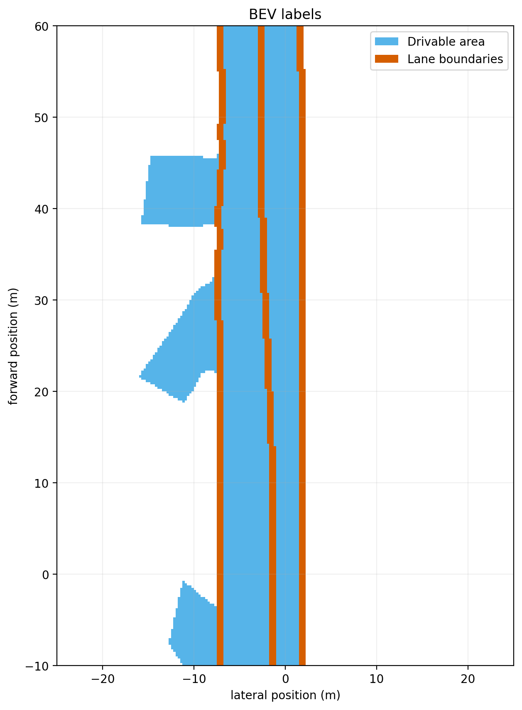

## Baseline 1: LiDAR-only drivable area prediction

### Input

The first model used three BEV channels from a single LiDAR sweep:

```text
1. LiDAR point density
2. LiDAR maximum height
3. LiDAR mean height
```

### Target

The target was the full rasterized HD map drivable area mask.

### Result

The LiDAR-only model learned broad road structure and often detected the dominant road corridor. However, it overpredicted drivable area near side streets and open regions. The predicted masks were smoother and less angular than the HD map labels.

Training loss decreased close to zero, while validation loss stayed much higher. This indicated that the model fit the training samples better than the validation samples.

### Figures

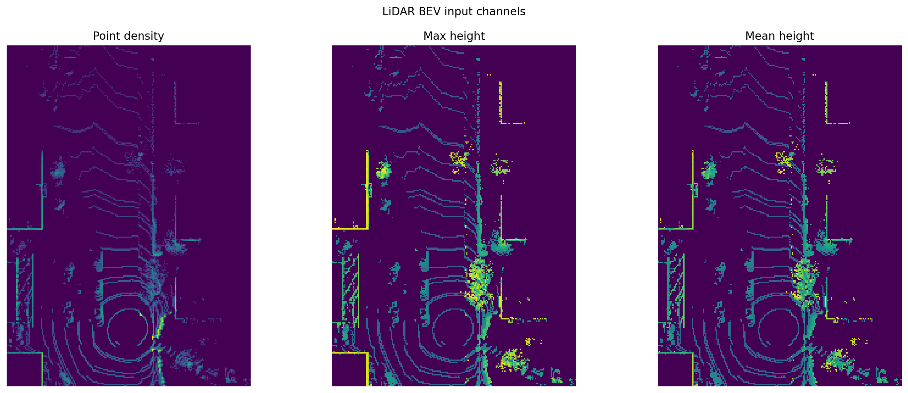

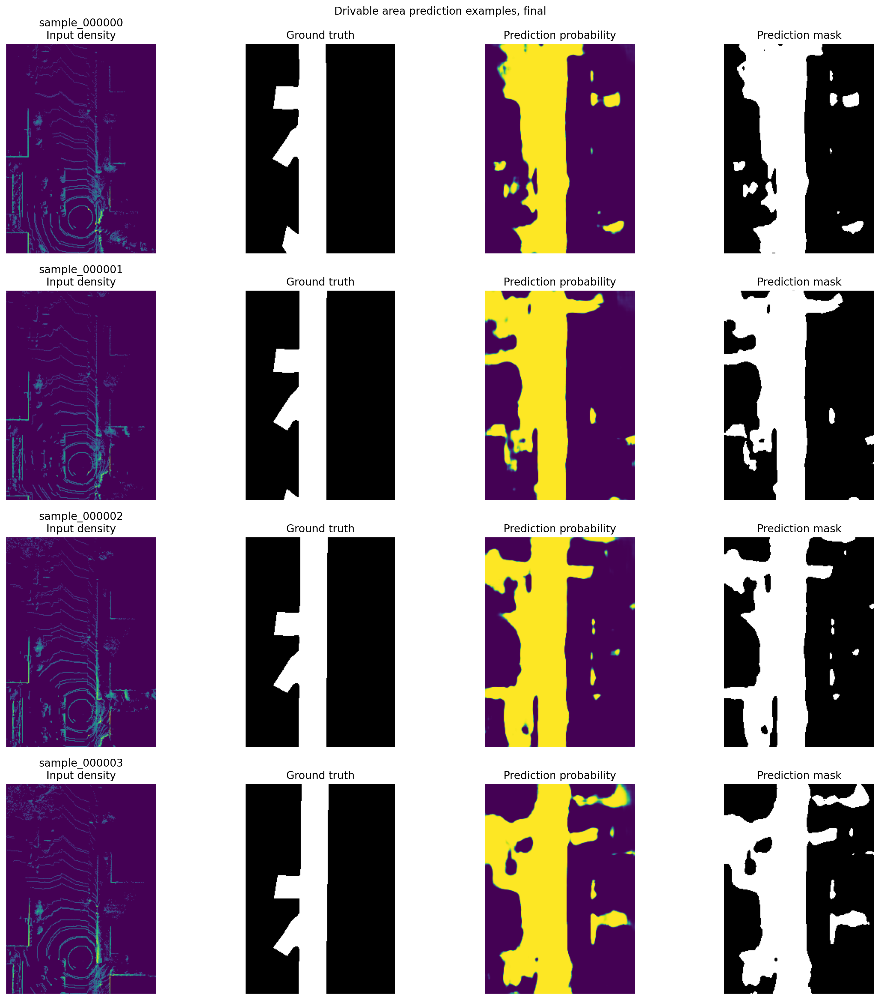

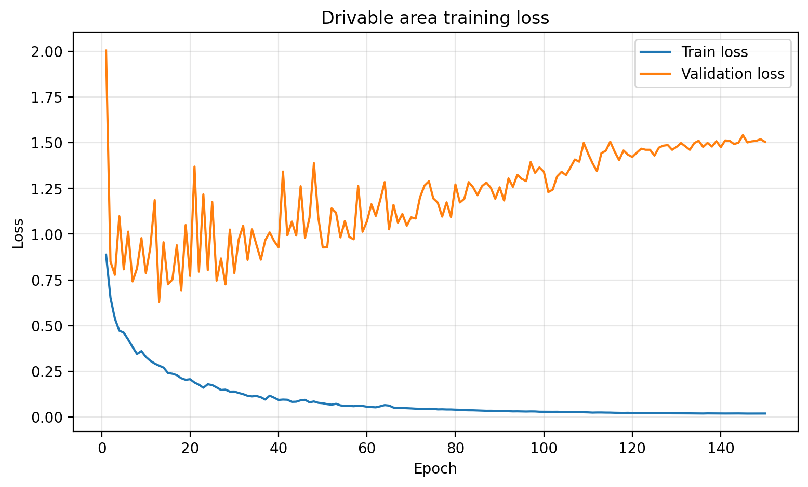

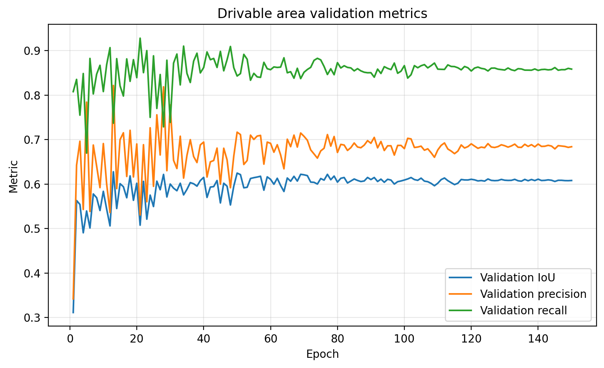

## Baseline 2: LiDAR plus camera color drivable area prediction

### Input

The second model added camera color sampled from seven Argoverse 2 ring cameras. For each LiDAR point, the point was projected into the closest timestamped camera image, the RGB value was sampled, and the color was accumulated into the same BEV cell as the LiDAR point.

The input had six BEV channels:

```text
1. LiDAR point density
2. LiDAR maximum height
3. LiDAR mean height
4. Mean red value from projected camera pixels
5. Mean green value from projected camera pixels
6. Mean blue value from projected camera pixels
```

The seven ring cameras were:

```text
ring_front_center
ring_front_left
ring_front_right
ring_side_left
ring_side_right
ring_rear_left
ring_rear_right
```

### Target

The target was still the full rasterized HD map drivable area mask.

### Result

Adding camera color improved the visual quality of the drivable area predictions. The model produced stronger main road predictions than the LiDAR-only baseline. However, it still overpredicted side streets and open regions. Later epochs added more false positive regions, so the best visual results appeared before the final epoch.

### Figures

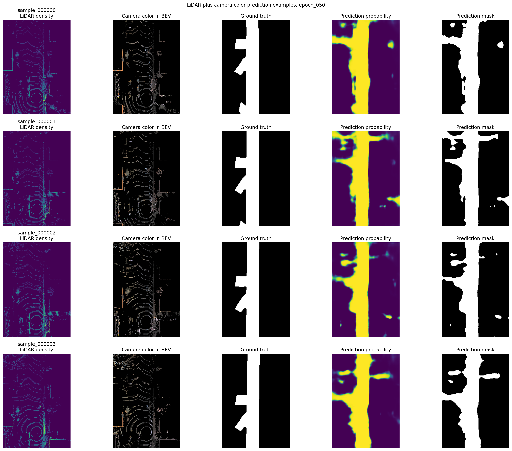

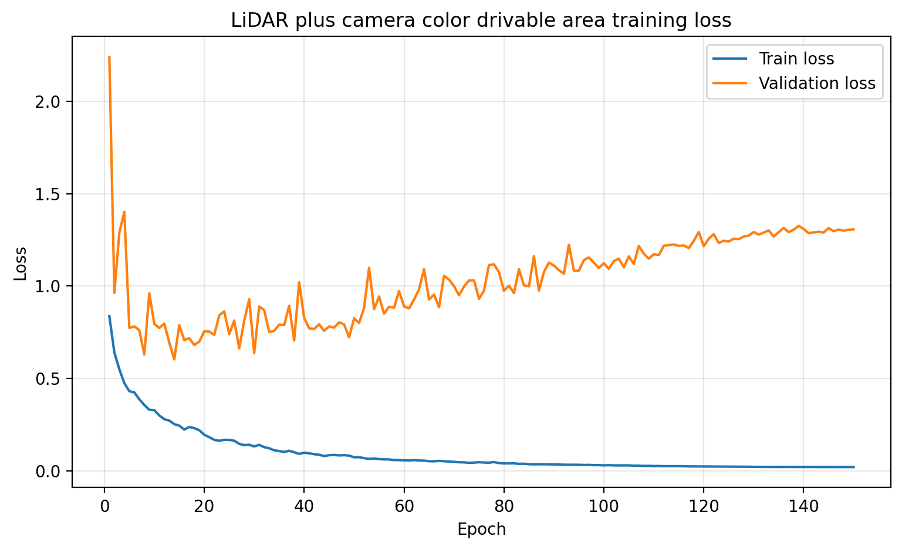

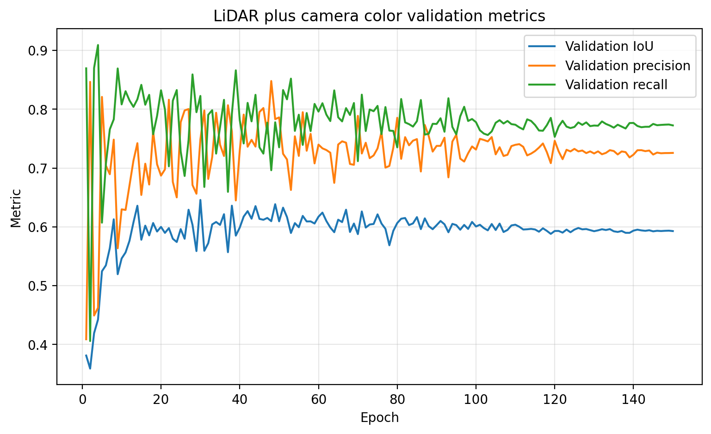

## Baseline 3: Main road corridor target

### Motivation

The full drivable area target included side streets, connected road polygons, and broad open drivable regions. This target was too broad for the initial models and encouraged side street overprediction.

The third experiment changed the target to a main road corridor derived from lane boundary geometry. This made the task more focused on the ego-aligned road corridor.

### Input

The model used the same six-channel LiDAR plus camera color input as the previous baseline.

### Target

The target was a main road corridor mask derived from ego-aligned lane boundary geometry.

The label creation process was:

1. Transform lane geometry into the ego vehicle frame.
2. Filter lane segments by heading alignment with the ego vehicle direction.
3. Rasterize the aligned lane regions into a corridor mask.
4. Clean the mask to reduce disconnected islands.
5. Generate outer boundaries for visualization.

### Result

The main road corridor model produced cleaner predictions than the full drivable area models. It focused more strongly on the main road and produced fewer disconnected islands.

The model also improved on samples where vehicles initially caused underprediction. Later training helped the model treat vehicles as objects on top of the road rather than gaps in the corridor.

Validation loss still increased while training loss decreased, but validation loss was lower than in the earlier drivable area experiments. The remaining issue was overprediction near side streets and sidewalks.

### Figures


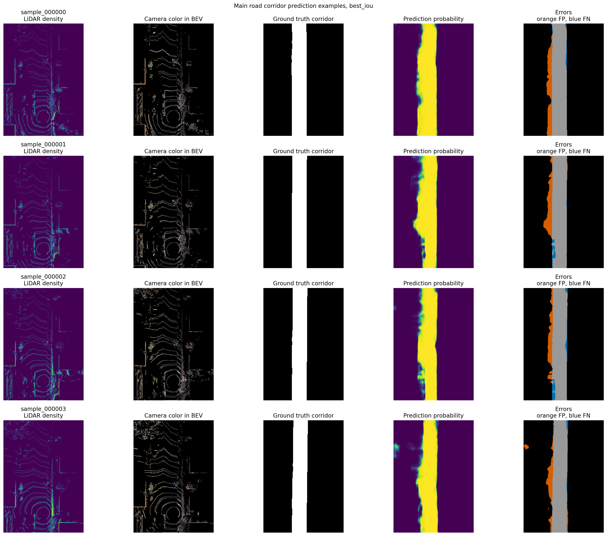

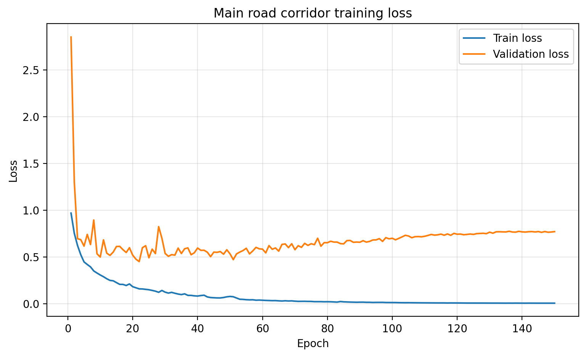

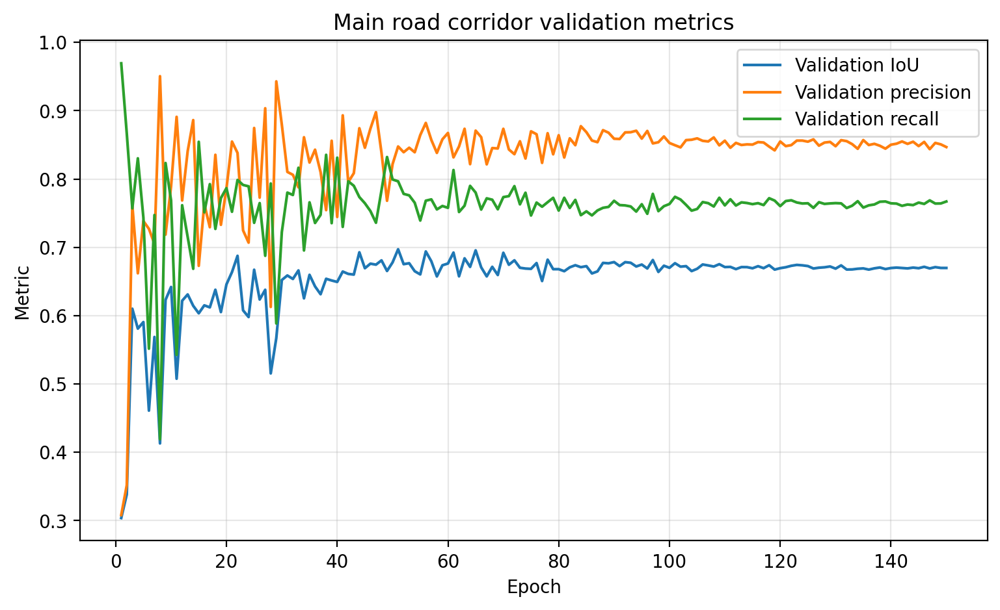

## Baseline 4: Position feature main road corridor model

### Motivation

The main road corridor target improved the task, but the model still struggled with side streets, angled roads, and farther forward regions. The final experiment added explicit spatial context to the input.

### Input

The final model used eleven BEV channels:

```text
1. LiDAR point density
2. LiDAR maximum height
3. LiDAR mean height
4. Mean red value from projected camera pixels
5. Mean green value from projected camera pixels
6. Mean blue value from projected camera pixels
7. Normalized distance from ego
8. Sine of angle from ego
9. Cosine of angle from ego
10. Normalized forward position
11. Normalized lateral position
```

Both sine and cosine angle channels were used to represent direction continuously.

### Target

The target was the same main road corridor mask derived from ego-aligned lane boundary geometry.

### Split strategy

The final model used a random sample split instead of a scene-level split. This placed validation samples in the same overall scene distribution as the training data, which was more appropriate for this focused baseline comparison.

### Result

The position feature main road corridor model produced the strongest result in the project. It identified the main drivable corridor well in the best validation examples, especially on straight road sections.

Postprocessing improved the final output by keeping the ego-connected component, filling holes, and removing disconnected prediction islands. This was appropriate because the target is a continuous road corridor connected to the ego vehicle.

Validation loss stayed higher than training loss and ended around the 0.75 range. The best checkpoint was more useful than the final epoch because the model continued fitting training samples after the best validation behavior had appeared.

The remaining limitations were angled roads, farther forward regions, and internal non-drivable regions inside the mapped corridor.

### Figures


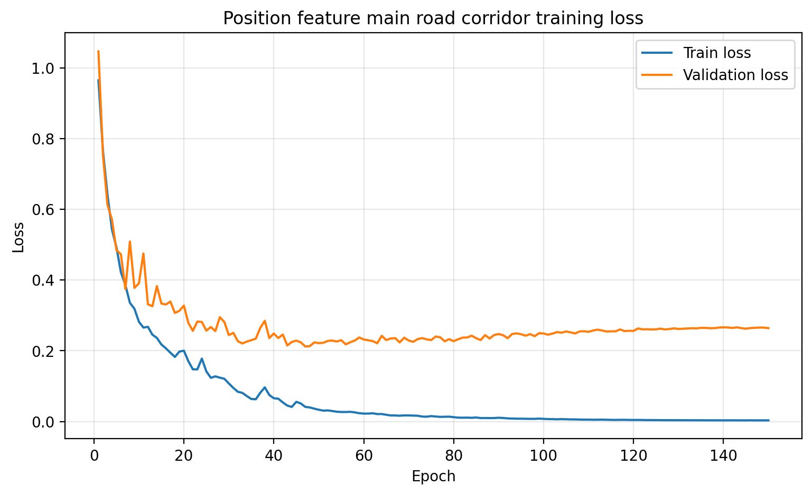


## Experiment comparison

| Model | Input | Target | Main result | Main limitation |
|---|---|---|---|---|
| LiDAR only | Point density, maximum height, mean height | Full drivable area | Learned broad road structure | Overpredicted side streets and produced smooth boundaries |
| LiDAR plus camera color | LiDAR channels plus RGB sampled from seven ring cameras | Full drivable area | Improved visual quality and main road detection | Still overpredicted side streets |
| Main road corridor | LiDAR plus camera color | Ego-aligned corridor from lane geometry | Cleaner main road focus and fewer islands | Still overpredicted near side streets and sidewalks |
| Position feature main road corridor | LiDAR, camera color, distance, angle, forward position, lateral position | Ego-aligned corridor from lane geometry | Best result, strong straight-road predictions, useful postprocessing | Angled roads and farther forward regions were less accurate |

## Main findings

### Target definition mattered

The full drivable area target was too broad. It included side streets, connected road polygons, and open drivable regions that were difficult to infer cleanly from a single BEV input. The main road corridor target produced a cleaner and more focused learning problem.

### Camera color helped

Adding camera color improved the model compared with LiDAR-only inputs. It gave the model useful visual context for road appearance and surrounding structure.

### Position features produced the strongest result

Adding distance from ego, angular encoding, forward position, and lateral position produced the strongest model. These features helped the model distinguish the ego-aligned corridor from side streets and lateral branches.

### Postprocessing improved usability

Keeping the ego-connected component and filling holes produced cleaner outputs by removing disconnected islands. This matched the structure of the target, which is a continuous main road corridor.

### Road angle affected performance

Straight roads produced the best predictions. Roads at stronger angles were less accurate but still reasonable. Curved roads would likely be more difficult because the target corridor changes direction across the BEV image.

### Farther forward regions were less reliable

Predictions were better near the ego vehicle and less reliable farther forward. This is consistent with sparser LiDAR observations and reduced image clarity at longer range.

## Interpretation

The experiments show that target definition and input representation had the largest effect on prediction quality. The strongest result came from a focused main road corridor target with LiDAR features, camera color, and explicit spatial encoding.

The final model was not a production road geometry system, but it was a useful baseline. It demonstrated how camera, LiDAR, ego pose, HD map geometry, BEV representation, target design, spatial encoding, and postprocessing affect road corridor segmentation.

## Conclusion

This project demonstrates a complete BEV road geometry workflow:

1. Load autonomous driving sensor data.
2. Align camera and LiDAR.
3. Project LiDAR into camera images.
4. Create BEV LiDAR and map visualizations.
5. Rasterize HD map drivable area and lane labels.
6. Build LiDAR-only BEV inputs.
7. Build LiDAR plus camera color BEV inputs.
8. Create a main road corridor target from ego-aligned lane geometry.
9. Add explicit ego-position encoding.
10. Train and compare segmentation baselines.
11. Apply postprocessing to remove disconnected islands.
12. Analyze strengths and failure modes.

The final position feature model produced the strongest results. It identified the main road corridor well, especially on straight roads, and postprocessing created a cleaner continuous output.

The project is complete as a baseline study. It shows that road corridor segmentation improves when the target is focused, camera context is added, and the model receives explicit spatial information about distance, angle, forward position, and lateral position.
